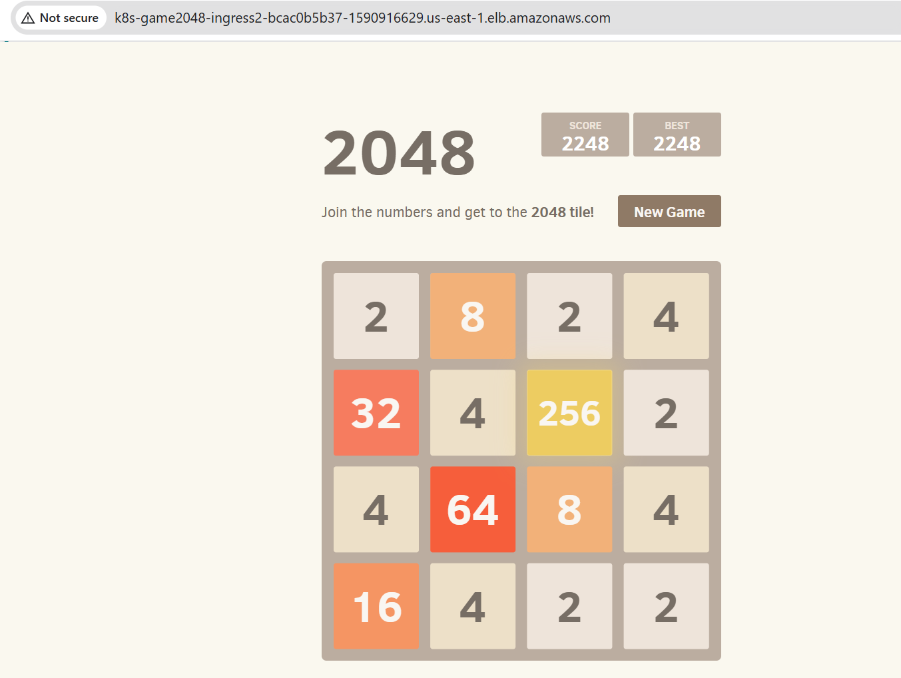

# End-to-End Kubernetes Deployment on AWS EKS with ALB Ingress

Project Overview

This project demonstrates a production-style Kubernetes deployment on AWS EKS using Fargate. It includes application deployment, AWS Application Load Balancer (ALB) Ingress configuration, and secure IAM integration using IAM Roles for Service Accounts (IRSA).

Architecture
- AWS EKS Cluster (Fargate)
- Kubernetes Deployment (2048 Game App)
- Kubernetes Service (ClusterIP)
- AWS Load Balancer Controller (ALB Ingress)
- IAM Roles for Service Accounts (IRSA)
- AWS VPC Networking

Prerequisites (Local Machine Setup)
- kubectl → Manage Kubernetes cluster
- eksctl → Create and manage EKS clusters
- AWS CLI → Manage AWS services
- Helm → Install Kubernetes applications

# Configure AWS CLI:
aws configure
# Provide:
- AWS Access Key
- Secret Key
- Region (us-east-1)
- Output format (json)

# Step 1: Create EKS Cluster using Fargate
eksctl create cluster --name demo-cluster --region us-east-1 --fargate

# Verify cluster:
aws eks list-clusters

# Connect kubectl:
aws eks update-kubeconfig --region us-east-1 --name demo-cluster

# Step 2: Create Fargate Profile
eksctl create fargateprofile --cluster demo-cluster --region us-east-1 --name alb-sample-app --namespace game-2048

# Step 3: Deploy Application (Deployment + Service + Ingress)
kubectl apply -f deployment.yml

# Step 4: Enable IAM OIDC Provider (IRSA)
eksctl utils associate-iam-oidc-provider --cluster demo-cluster --approve

# Step 5: Create IAM Policy for ALB Controller
curl -o iam_policy.json https://raw.githubusercontent.com/kubernetes-sigs/aws-load-balancer-controller/main/docs/install/iam_policy.json

aws iam create-policy \
  --policy-name AWSLoadBalancerControllerIAMPolicy \
  --policy-document file://iam_policy.json

# Step 6: Create IAM Role for Service Account
   eksctl create iamserviceaccount \
  --cluster=demo-cluster \
  --namespace=kube-system \
  --name=aws-load-balancer-controller \
  --role-name AmazonEKSLoadBalancerControllerRole \
  --attach-policy-arn=arn:aws:iam::<your-aws-account-id>:policy/AWSLoadBalancerControllerIAMPolicy \
  --approve
   
# Check created IAM Role
   aws iam get-role --role-name AmazonEKSLoadBalancerControllerRole

# Step 7: Install AWS Load Balancer Controller (Helm)
- helm repo add eks https://aws.github.io/eks-charts
- helm repo update eks

helm install aws-load-balancer-controller eks/aws-load-balancer-controller \
  -n kube-system \
  --set clusterName=demo-cluster \
  --set serviceAccount.create=false \
  --set serviceAccount.name=aws-load-balancer-controller \
  --set region=us-east-1 \
  --set vpcId=vpc-069b895d85815b8ac
  
# Step 8: Verify Deployment 
kubectl get deployment -n kube-system aws-load-balancer-controller
Expected output: READY 2/2

# Step 9: Access Application
Get ALB URL:
kubectl get ingress -n game-2048

# Application Output (2048 Game App with ALB)

  

